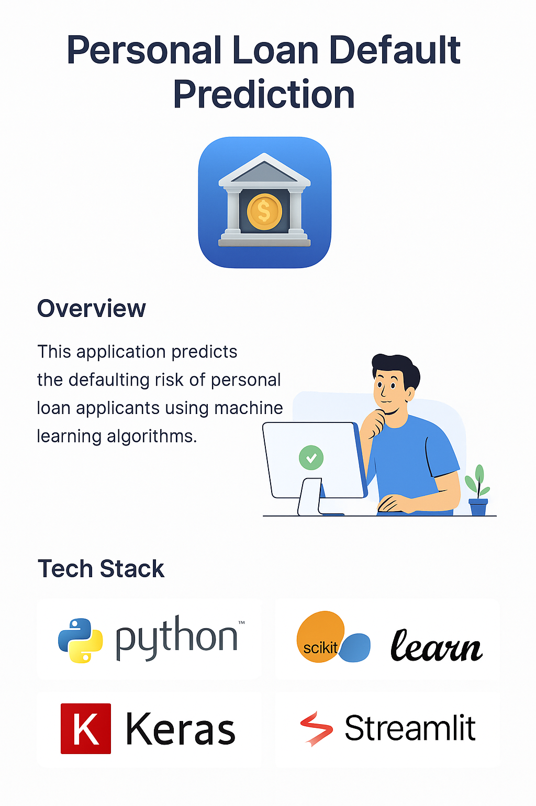
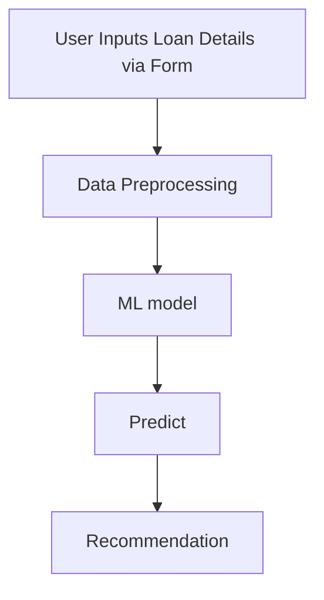
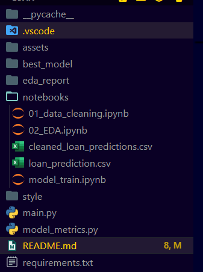
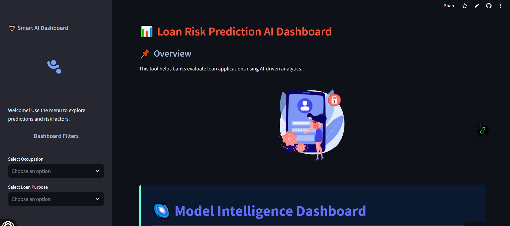
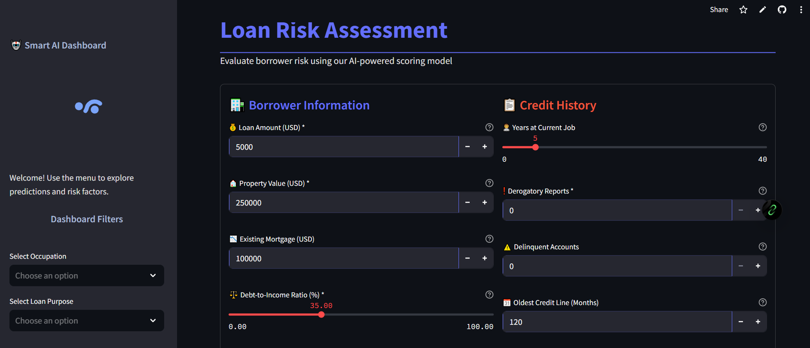
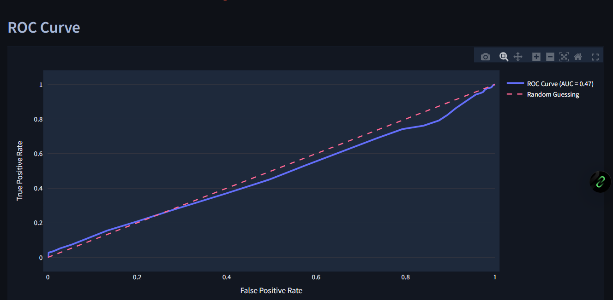
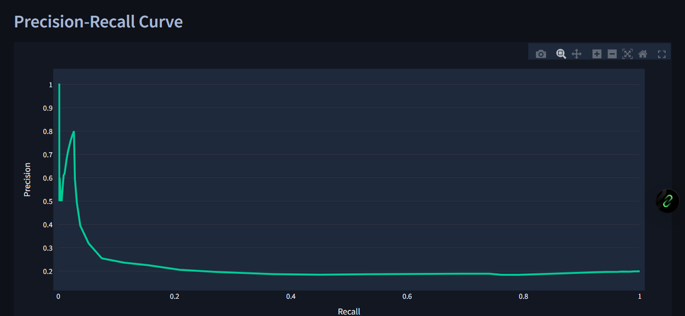
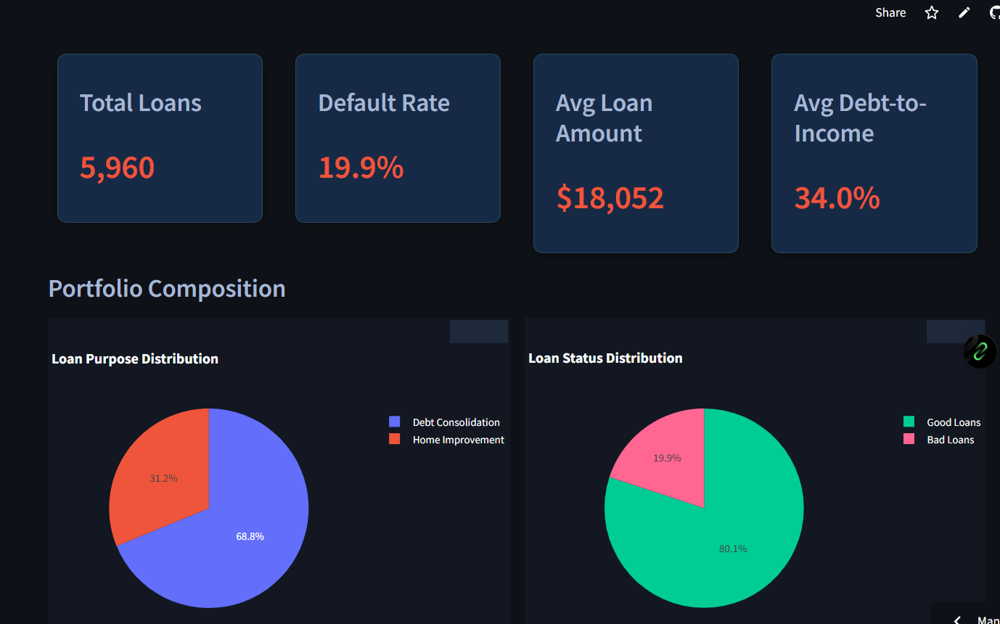
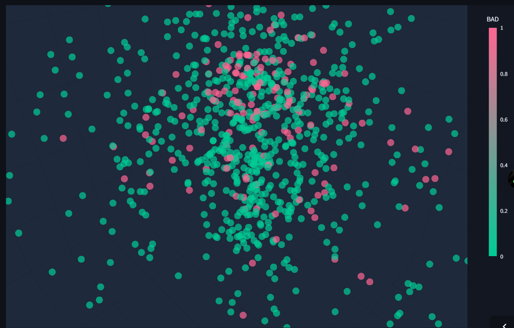

# 💰 Personal Loan Default Prediction - Streamlit Application

> **Live Demo**: [Click here to try the app 🚀](https://personalloanprediction.streamlit.app/)

---



---

## 🧹 Problem Statement

Financial institutions face increasing challenges in accurately identifying applicants who might default on personal loans. Misclassification can lead to bad debts, regulatory issues, and loss of trust. A reliable prediction system can help mitigate risk, enhance operational efficiency, and drive smarter lending decisions.

---

## 🎯 Goal of the Project

- ✅ Predict the probability of loan default based on customer attributes
- ✅ Provide a production-ready, interactive Streamlit app for banks and analysts
- ✅ Explain predictions with SHAP visualizations
- ✅ Export reports to share insights with decision-makers

---

## 🛠️ Flow Diagram



---

## 📂 Folder Structure



---

## 🛠️ Tech Stack

| Layer             | Technology                      |
|------------------|----------------------------------|
| **Frontend**     | Streamlit                        |
| **Backend**      | Python                           |
| **ML Models**    | Logistic Regression, Random Forest, XGBoost |
| **Visualization**| Plotly, Matplotlib, SHAP         |
| **Export Tools** | PDFKit, Streamlit Export         |

---

## 🧠 Code Walkthrough

```python
# Load the model
model = pickle.load(open("model/model.pkl", "rb"))

# Preprocess user inputs
def preprocess(data):
    ...
    return processed_input

# Make prediction
prediction = model.predict(processed_input)

# Show results
st.success(f"Prediction: {'Approved' if prediction==0 else 'Rejected'}")
```

---
[Automate EDA REPORT](https://ankityadav-problemsolver.github.io/Personal_Loan_Default_Prediction/)

---

## 🞼 Application UI & Screenshots

### 🔘 Home Page



### 🔢 Prediction Form



### 🔢 Prediction Result


### 📉 ROC AUC Curve



### 🎟️ Precision_Recall Curve



### 🎟️ Loan KPI



### 🎟️ 3D SCATTER



---

## ✨ Key Features

- 🔹 User-friendly UI built in Streamlit
- 🔹 Real-time loan eligibility prediction
- 🔹 Support for multiple ML models
- 🔹 SHAP visualizations for explainability
- 🔹 Exportable PDF reports
- 🔹 Clean, minimal, responsive design

---

## 🔮 Scientific Innovation

> What makes this project stand out:

- 🧠 **Explainable AI (XAI)**: Integrates SHAP values to explain each prediction
- 🧬 **Bias Check Module**: Identify model fairness issues across genders/ages
- ✨ **Risk Interpretation Layer**: Converts numeric predictions into easy-to-understand advice
- 🚀 **Model Comparator**: Visual comparison between Logistic, Random Forest & XGBoost

---

## 🚀 Future Enhancements

- 🚀 Aadhaar/PAN Verification via Gemini API
- 🎮 Voice-based AI Assistant for customer service
- 🤖 Chatbot integration for insights
- 📊 Historical dashboard for tracking applicant trends
- 👨‍📈 Credit score simulator based on customer profile edits

---

## 🚧 How to Run Locally

```bash
# Step 1: Clone the repo
git clone https://github.com/yourusername/personal-loan-prediction.git
cd personal-loan-prediction

# Step 2: Install dependencies
pip install -r requirements.txt

# Step 3: Run the application
streamlit run app.py
```

---

## 🧳 Collaboration & Contribution

We'd love your help! You can:

- ✨ Improve UI/UX
- 🧠 Optimize the model pipeline
- 📉 Add new data sources or APIs
- 🤝 Translate into local languages

### How to Contribute

```bash
# Fork the repository
# Create your feature branch
git checkout -b feature/new-awesome-feature

# Commit and push your changes
git commit -m "Added awesome feature"
git push origin feature/new-awesome-feature

# Submit a Pull Request
```

---

## 📢 Contact Me

| Platform       | Link                                    |
|----------------|------------------------------------------|
| 💼 LinkedIn    | [Ankit Yadav](https://www.linkedin.com/in/ankityadav-datasolver/) |
| 💻 GitHub      | [Ankit Yadav](https://github.com/ankityadav-problemsolver/)             |
| 📧 Email       | <ankitofficial151@gmail.com>                 |

---

## 📄 License

This project is licensed under the **MIT License**. Feel free to fork, adapt, and build upon it for your use case!

---

## 💎 Pro Tip

Use this architecture as a blueprint for any classification-based real-time prediction system with SHAP explainability, PDF reporting, and clean UI design.

---

## 🔹 Tags

`#LoanPrediction` `#StreamlitApp` `#ExplainableAI` `#SHAP` `#FinanceAI` `#BankingML` `#CreditScoring`

---
